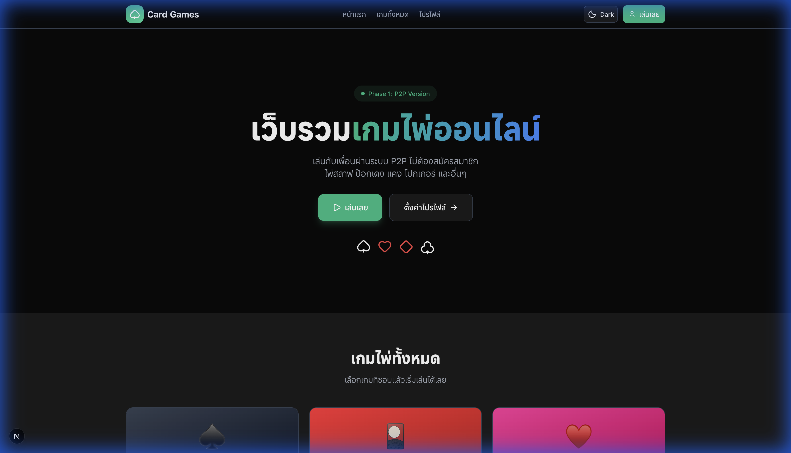
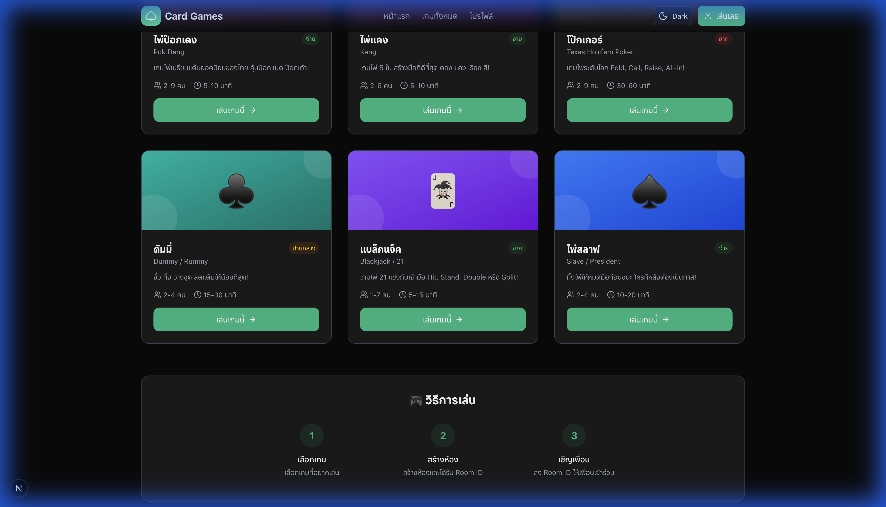
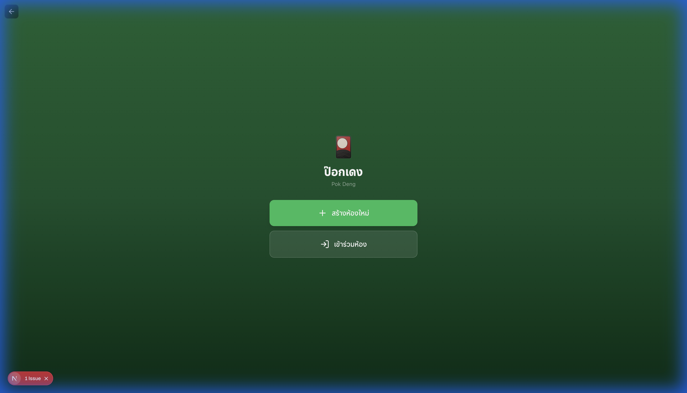
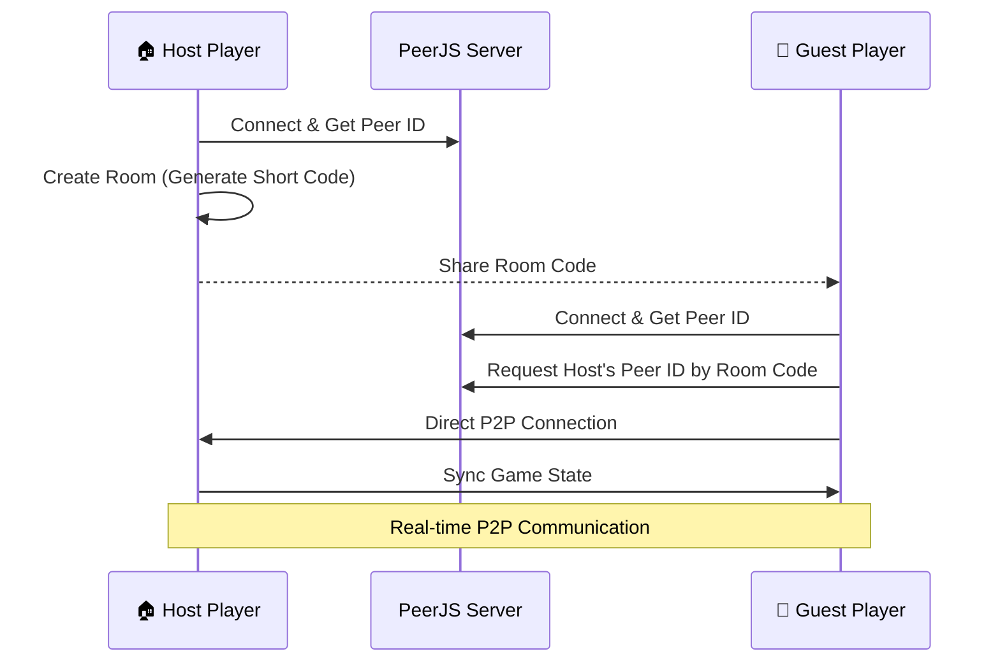

<p align="center">
  
  
  
  
</p>

<p align="center">
  
  
  
  
  
</p>

<h1 align="center">🃏 Card Game P2P</h1>

<p align="center">
  <strong>เว็บรวมเกมไพ่ออนไลน์แบบ Peer-to-Peer</strong><br/>
  เล่นกับเพื่อนได้ทันที ไม่ต้องสมัครสมาชิก ไม่ต้องมี Server
</p>

<p align="center">
  <a href="#-features">Features</a> •
  <a href="#-screenshots">Screenshots</a> •
  <a href="#-games">Games</a> •
  <a href="#-tech-stack">Tech Stack</a> •
  <a href="#-quick-start">Quick Start</a> •
  <a href="#-architecture">Architecture</a> •
  <a href="#-contributing">Contributing</a>
</p>

---

## 📸 Screenshots

<p align="center">
  
  <em>Landing Page - หน้าแรกของเว็บไซต์</em>
</p>

<p align="center">
  
  <em>Games Hub - หน้ารวมเกมทั้งหมด</em>
</p>

<p align="center">
  
  <em>Pok Deng - ห้องเล่นเกมป๊อกเด้ง</em>
</p>

---

## ✨ Features

| Feature | Description |
|---------|-------------|
| 🌐 **P2P Multiplayer** | เชื่อมต่อโดยตรงระหว่างผู้เล่นด้วย PeerJS ไม่ต้องพึ่งพา Server |
| 🎮 **6 Card Games** | รวมเกมไพ่ยอดนิยม 6 เกม พร้อมเล่นทันที |
| 🏠 **Room System** | สร้างห้องและแชร์ลิงก์ให้เพื่อนเข้าร่วมได้ง่าย |
| 🌙 **Dark Mode** | รองรับ Dark/Light Mode |
| 💾 **Local Storage** | เก็บข้อมูลผู้เล่นใน Browser ไม่ต้องสมัครสมาชิก |
| 📱 **Responsive** | รองรับทุกขนาดหน้าจอ Desktop และ Mobile |
| ⚡ **Real-time** | อัพเดทสถานะเกมแบบ Real-time |
| 🎨 **Modern UI** | ออกแบบด้วย Tailwind CSS สวยงามทันสมัย |

---

## 🎮 Games

| Game | Thai Name | Players | Status |
|------|-----------|---------|--------|
| **Pok Deng** | ป๊อกเด้ง | 2-9 | ✅ Available |
| **Kang** | ไพ่แคง | 2-6 | ✅ Available |
| **Blackjack** | แบล็คแจ็ค | 1-7 | ✅ Available |
| **Texas Hold'em Poker** | โป๊กเกอร์ | 2-9 | ✅ Available |
| **Dummy** | ดัมมี่ | 2-4 | ✅ Available |
| **Slave / President** | ไพ่สลาฟ | 2-4 | ✅ Available |

---

## 🛠 Tech Stack

### Frontend
- **[Next.js 15](https://nextjs.org/)** - React Framework with App Router & Turbopack
- **[React 19](https://react.dev/)** - UI Library
- **[TypeScript](https://www.typescriptlang.org/)** - Type Safety
- **[Tailwind CSS 4](https://tailwindcss.com/)** - Utility-first CSS
- **[Zustand](https://zustand-demo.pmnd.rs/)** - State Management
- **[React Hook Form](https://react-hook-form.com/)** + **[Zod](https://zod.dev/)** - Form Validation
- **[Lucide React](https://lucide.dev/)** - Icons
- **[next-themes](https://github.com/pacocoursey/next-themes)** - Dark Mode

### P2P & Real-time
- **[PeerJS](https://peerjs.com/)** - WebRTC P2P Library
- **[Colyseus](https://colyseus.io/)** - Multiplayer Game Server (Phase 2)

### Storage
- **[localforage](https://localforage.github.io/localForage/)** - Offline Storage
- **[Supabase](https://supabase.com/)** - Backend as a Service (Phase 2)

---

## 🚀 Quick Start

### Prerequisites

- **Node.js** >= 18.x
- **npm** or **yarn** or **pnpm**

### Installation

```bash
# Clone the repository
git clone https://github.com/danya0365/card-game-p2p-nextjs.git

# Navigate to the project
cd card-game-p2p-nextjs

# Install dependencies
npm install
# or
yarn install

# Copy environment variables
cp .env.example .env.local

# Start development server
npm run dev
# or
yarn dev
```

Open [http://localhost:3000](http://localhost:3000) to see the app.

### Scripts

| Command | Description |
|---------|-------------|
| `npm run dev` | Start development server with Turbopack |
| `npm run build` | Build for production |
| `npm run start` | Start production server |
| `npm run lint` | Run ESLint |
| `npm run type-check` | Run TypeScript type checking |

---

## 🏗 Architecture

This project follows **Clean Architecture** principles with a clear separation of concerns:

```
card-game-p2p-nextjs/
├── app/                          # Next.js App Router
│   ├── layout.tsx               # Root layout with providers
│   ├── page.tsx                 # Landing page
│   ├── games/
│   │   ├── page.tsx            # Games hub
│   │   ├── pokdeng/            # Pok Deng game
│   │   ├── kang/               # Kang game
│   │   ├── blackjack/          # Blackjack game
│   │   ├── poker/              # Texas Hold'em Poker
│   │   ├── dummy/              # Dummy game
│   │   └── slave/              # Slave / President game
│   └── (main-layout)/          # Pages with MainLayout
│
├── src/
│   ├── domain/                  # 🎯 Business Logic & Types
│   │   ├── entities/           # Game entities (User, Card, Room)
│   │   └── types/              # TypeScript types
│   │
│   ├── infrastructure/          # 🔌 External Services
│   │   ├── peer/               # PeerJS service
│   │   └── storage/            # localStorage/localforage
│   │
│   └── presentation/            # 🎨 UI Layer
│       ├── components/         # React components (Atomic Design)
│       │   ├── atoms/          # Buttons, Inputs, Cards
│       │   ├── molecules/      # PlayerCard, GameCard
│       │   ├── organisms/      # Header, Footer, GameTable
│       │   └── templates/      # MainLayout, GameLayout
│       ├── providers/          # Context providers
│       └── stores/             # Zustand stores
│
├── public/                      # Static assets
│   ├── fonts/                  # Custom fonts
│   └── styles/                 # Global styles
│
└── docs/
    └── screenshots/            # Documentation screenshots
```

### Layer Responsibilities

| Layer | Responsibility |
|-------|---------------|
| **Domain** | Business logic, game rules, entities และ types ทั้งหมด |
| **Infrastructure** | External services เช่น PeerJS, localStorage |
| **Presentation** | UI components, stores, และ providers |

---

## 🎮 How It Works

### P2P Connection Flow



### Game State Sync

1. **Host** เป็นผู้ควบคุม Game State หลัก
2. เมื่อมีการเปลี่ยนแปลง Host จะ broadcast ไปยังผู้เล่นทุกคน
3. ผู้เล่นแต่ละคนจะ sync state จาก Host

---

## 🗺 Roadmap

### Phase 1 (Current) ✅
- [x] P2P Multiplayer with PeerJS
- [x] 6 Card Games
- [x] Local user profile
- [x] Dark/Light mode
- [x] Responsive design

### Phase 2 (Planned) 🔮
- [ ] Supabase Authentication
- [ ] Persistent user profiles
- [ ] Leaderboards
- [ ] Game history
- [ ] Colyseus server for better sync

### Phase 3 (Future) 🌟
- [ ] Tournament mode
- [ ] Spectator mode
- [ ] Mobile app (React Native)
- [ ] Voice chat

---

## 🤝 Contributing

Contributions are welcome! Please feel free to submit a Pull Request.

1. Fork the repository
2. Create your feature branch (`git checkout -b feature/AmazingFeature`)
3. Commit your changes (`git commit -m 'Add some AmazingFeature'`)
4. Push to the branch (`git push origin feature/AmazingFeature`)
5. Open a Pull Request

---

## 📄 License

This project is licensed under the MIT License - see the [LICENSE](LICENSE) file for details.

---

## 👏 Acknowledgments

- [Next.js](https://nextjs.org/) - The React Framework
- [PeerJS](https://peerjs.com/) - Simple P2P
- [Tailwind CSS](https://tailwindcss.com/) - Styling
- [Zustand](https://zustand-demo.pmnd.rs/) - State Management

---

<p align="center">
  Made with ❤️ in Thailand 🇹🇭
</p>

<p align="center">
  <a href="https://github.com/danya0365/card-game-p2p-nextjs">⭐ Star this repo if you find it useful!</a>
</p>
